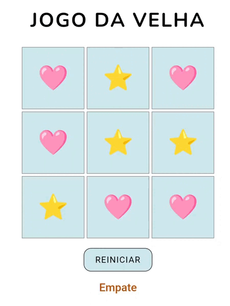
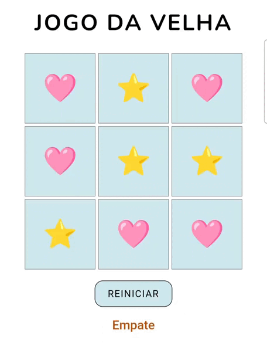

# ✨ Tic Tac Toe ✨

Um joguinho clássico de **Tic Tac Toe (Jogo da Velha)** feito com carinho usando **HTML, CSS e JavaScript**.  
Visual simples, cores suaves e símbolos em emoji para deixar tudo mais divertido.

## 🎮 Sobre o jogo

- Dois jogadores se revezam
- Cada jogador usa um símbolo:  
  o: "❤️",  
  x: "⭐️"
  
- O jogo indica:
  - De quem é a vez
  - Quem venceu
  - Quando deu empate
- Botão de reset para começar de novo 

## 🧩 Tecnologias usadas

- HTML
- CSS
- JavaScript

## 🖼️ Demonstração

Aqui estão alguns gifs mostrando o jogo funcionando:

## 🌱 Objetivo do projeto

Esse projeto foi criado a partir de um dos desafios do *Curso Desenvolvimento Web - Programador Br* como prática de:
- Manipulação do DOM
- Lógica de jogo
- Eventos de clique
- Organização básica de código em JavaScript

